# aigent

**A self-modifying AI agent platform built for developers and AI researchers.**

The agent runs directly on your machine as a child process, can read and edit its own source code, and talks to you through a browser-based UI. API keys never reach the agent process. All tool use is gated through a three-tier safety system.

---

## What it does

- Streams responses from Claude (Anthropic) or GPT (OpenAI) or any OpenAI-compatible endpoint
- Executes shell commands, reads/writes files, searches code, fetches URLs
- Modifies its own source — changes hot-reload, conversation survives restarts
- Maintains persistent memory across sessions (daily logs, curated MEMORY.md, workspace files)
- Proposes changes to host files via patches — you see a diff and approve before anything is written
- Spawns background sub-agents for long tasks without blocking your conversation
- Controls your Chrome browser via a companion extension (a11y tree, screenshots, tab management, script execution)
- Speaks responses aloud (local TTS) and listens via microphone (local STT)

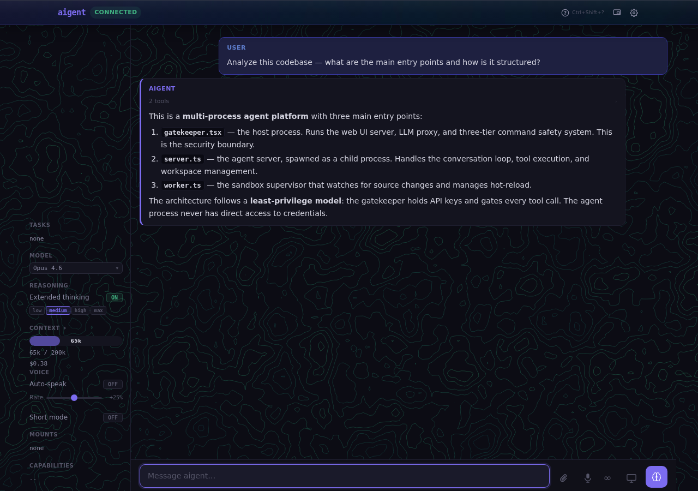

---

## Architecture

```
Host process: Gatekeeper (gatekeeper.tsx)
├── Web UI server  ←→  Browser
├── LLM proxy  (API keys never reach the agent process)
├── Three-tier command safety (Tier 1: hard deny, Tier 2: static allow/deny, Tier 3: Haiku classifier)
├── Permission broker  (file access, fetch, MCP tools)
└── Audit log  →  /tmp/aigent-audit.log
      ↕  NDJSON / Unix socket  (/tmp/aigent/worker.sock)
Child process: Agent server (server.ts)
├── agent.ts       — conversation loop, streaming, retry
├── provider.ts    — Anthropic + OpenAI abstraction
├── tools.ts       — 23 tools (all gated by gatekeeper)
├── workspace.ts   — memory system
└── compact.ts     — context compaction
```

**Security model:** The gatekeeper is the only process with API credentials. Every shell command, file write, and fetch the agent attempts must pass through the gatekeeper's safety pipeline before it executes. See [Security model](#security-model) below.

---

## Quick start

**Requirements:** Node.js 22+, Anthropic API key (or OAT subscription token)

```bash
git clone <repo> && cd aigent
cp .env.example .env        # add your ANTHROPIC_API_KEY
make dev-ts                 # launches gatekeeper + Vite dev server + Chrome plugin
```

Open `http://localhost:3141` in your browser (Vite dev server on `:5173` proxies to the backend).

To include TTS and STT services:

```bash
make dev     # gatekeeper + Vite + TTS + STT + Chrome plugin (kills stale ports first)
make dev-ts  # same, without TTS/STT services
make serve   # server only (no frontend dev server)
```

---

## Web UI features

### Speak

Three-state control in the sidebar: **off** | **on** | **short**

| Mode | What it does |
|------|-------------|
| **off** | No auto-speak; responses are text-only |
| **on** | Auto-speak enabled; full responses are read aloud via TTS |
| **short** | Auto-speak + short mode; the agent produces concise responses with a `<speak>` tag that is read aloud |

- **Push-to-talk** — `Ctrl+\`` or the mic button; transcription streams into the input box in real time
- **Always-on mode** — `Ctrl+Shift+\`` keeps the microphone open continuously; silence detection auto-submits
  - **Interrupt** — talk over the agent's response and VAD will stop it, letting you speak
  - **Edit during recording** — typing or pasting while the mic is recording preserves your edits; STT appends after your text instead of overwriting it
- **Text-to-speech** — speaker button on each assistant message reads it aloud
- **Speak preview** — assistant messages with a `<speak>` tag show a chat-bubble icon; hover to see the spoken summary without playing audio
- **Message rating** — ★ star trigger on each assistant message (appears on hover). Click to open a popover with a 1–5 star score picker and optional short notes. Rated messages stay visible (score badge shown on trigger). Ratings and notes are sent via WebSocket and averaged into episode records for continuous learning.
- **TTS rate control** — adjustable playback speed slider in the sidebar (-50% to +100%)
- **Audio device pickers** — choose speaker and microphone devices from the sidebar when TTS/STT is available

### Input

- `Enter` to send, `Shift+Enter` for newline
- `Ctrl+Enter` — one-shot thinking toggle (if thinking is off, sends with `high` reasoning; if thinking is on, sends without reasoning — then reverts)
- **Message queueing** — submitting while the agent is busy queues the message instead of blocking. Queued messages appear as dismissable chips above the input and are sent automatically in order as the agent becomes idle.
- `/` to open the slash-command palette with autocomplete
- `@` to open the mention palette — `@screen` starts screen sharing, `@clipboard` pastes clipboard content, `@image` attaches an image. Type a path prefix (`~/`, `/`, `./`) to browse the filesystem.

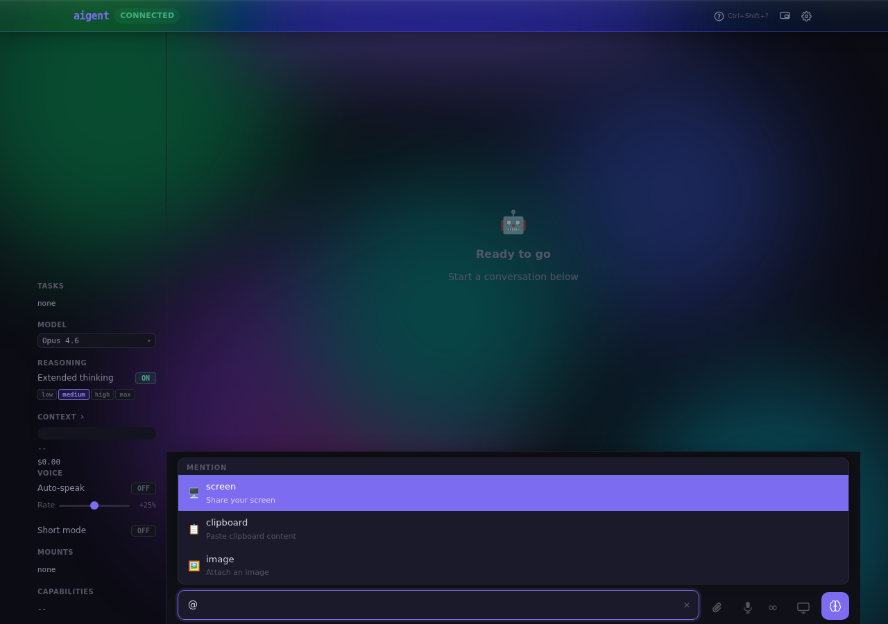

- Paste or drag files into the input box; attach via the paperclip button. Supported: images (PNG, JPEG, GIF, WebP), PDFs, plain text, and Markdown (up to 5 attachments)
- Screen-capture button grabs any window or tab via `getDisplayMedia` and attaches it as an image; while sharing, a snap button captures the current frame
- **Picture-in-Picture** — "Float (PiP)" button in the header pops the chat into a floating window (browsers with Document PiP API support)

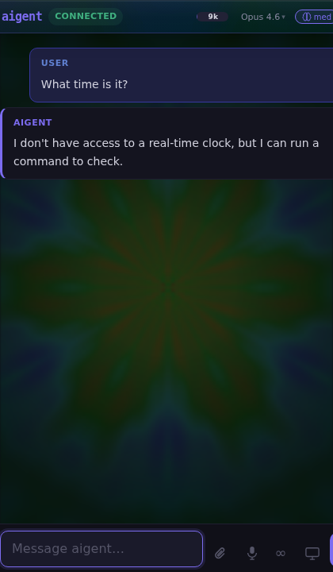

- `Ctrl+Shift+?` — open the keyboard shortcuts reference

### Slash commands

Type `/` to open the command palette. Available commands:

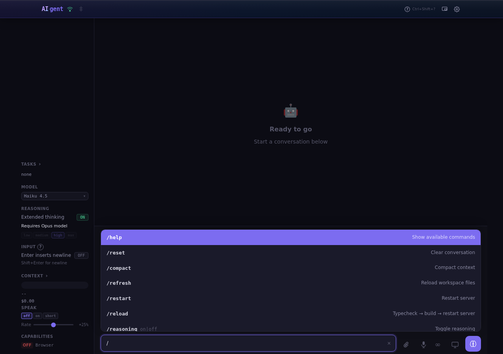

| Command | Description |
|---------|-------------|
| `/help` | Show available commands |
| `/reset` | Clear conversation and start fresh |
| `/compact` | Manually trigger context compaction |
| `/refresh` | Reload workspace files into the system prompt |
| `/restart` | Restart the agent server |
| `/reasoning on\|off` | Toggle extended thinking |
| `/effort low\|medium\|high\|max` | Set thinking budget |
| `/short on\|off` | Toggle short mode (also accessible via Speak pills in sidebar) |
| `/model <name>` | Show or switch the active model |
| `/image <path> [msg]` | Send an image from a host path |
| `/usage` | Show cumulative token and cost stats |
| `/context` | Open the context window inspector |
| `/tasks` | Show background task status |
| `/profiles` | List available profiles |
| `/profile <name>` | Switch to a different profile |
| `/save` | Save the current session |
| `/sessions` | List saved sessions |
| `/load <id>` | Load a saved session |
| `/grant` / `/deny` | Approve or deny a pending permission request |
| `/approve` / `/reject` | Approve or reject a pending config-write request |
| `/preview` | Preview a pending config-write diff |
| `/approve-patch` / `/reject-patch` | Approve or reject a pending patch request |

### Reasoning & effort

Toggles in the left sidebar:

| Control | What it does |
|---------|-------------|
| Reasoning on/off | Enable/disable extended thinking |
| Effort level (min → max) | Budget tokens allocated to thinking |

Settings persist across reloads. The agent applies thinking heuristics automatically — short messages get lower effort to save tokens. `Ctrl+Enter` temporarily toggles thinking for one message.

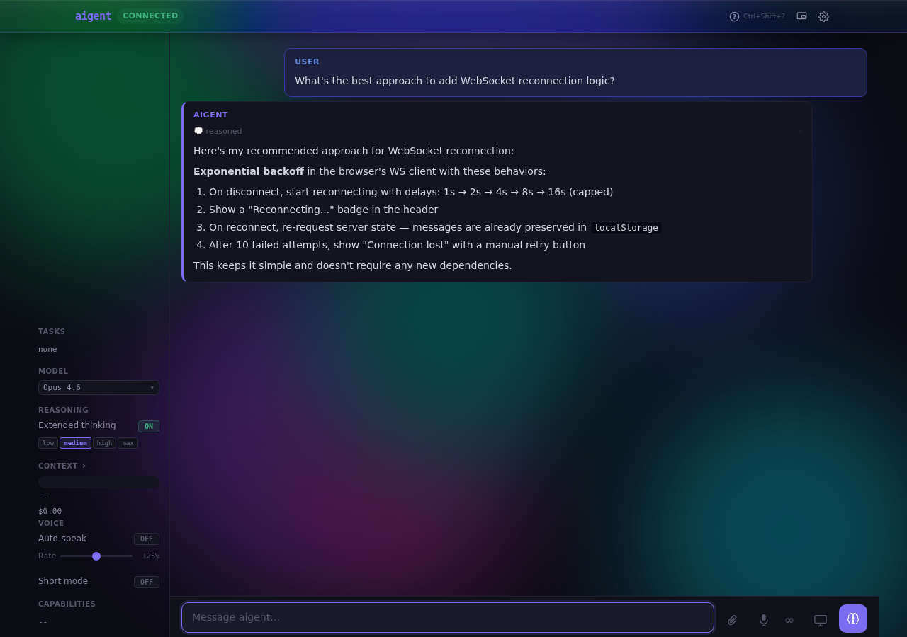

### Model picker

Choose any available model from the sidebar dropdown. The list is fetched live from the Anthropic API and falls back to a hardcoded default. Selection persists across restarts.

The agent can also switch its own model mid-conversation via the `switch_model` tool — upgrading for complex tasks, downgrading for cheap ones.

### Background tasks

Dispatched via the `dispatch_task` tool. Shown in the sidebar with:

- Live spinner + elapsed time while running
- Context usage (tokens) and model used for each task
- Checkmark / ✗ on completion or failure

Background tasks can use cheaper models (e.g. Haiku for read-only work) to keep costs down. Multiple tasks run in parallel; completed results are injected into the conversation when the agent is next idle.

Tasks with `delivery: user-pull` pop up a result panel when completed. The panel renders the result as markdown. Two actions are available:

- **Discuss with agent** — closes the panel and sends a short reference message (the agent reads the full result from context, not pasted inline)
- **Defer** — closes the panel without sending anything; reopen it later by clicking the task in the sidebar

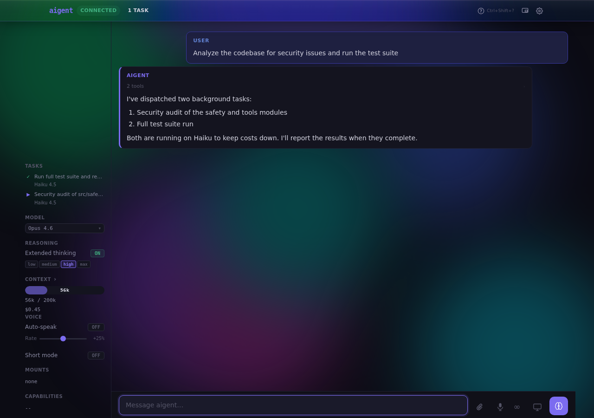

**Tasks Inspector** — click the "Tasks ›" label in the sidebar to open the Tasks Inspector modal. It shows a persistent history of all dispatched tasks (survives page refresh), with:

- Summary bar: total tasks, tokens, and cost
- Sortable grid: status, description, model, tokens, cost
- Expandable detail: full metadata (ID, delivery mode, timing), the exact prompt sent to the background agent, and the complete result (markdown-rendered)

### Tool visibility

Tool calls are shown inline in the chat — name, input summary, and output excerpt. Collapsed by default; click to expand and see the full input and output. Tools that return images (screenshots, clipboard, browser captures) display them inline in the trace block — click to open full-size in a new tab.

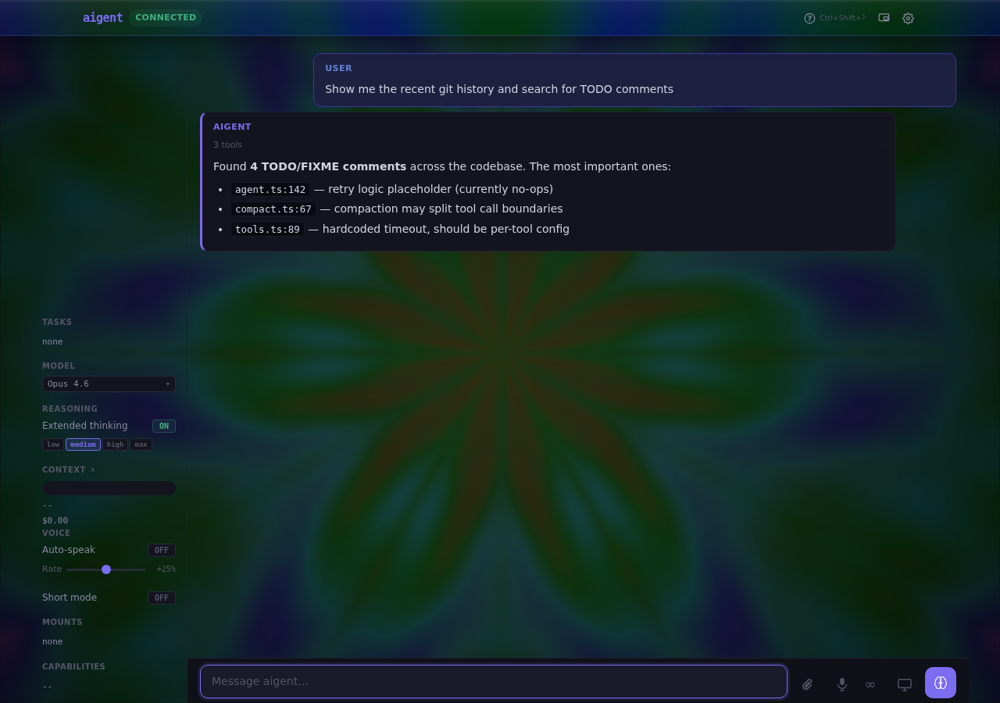

Click any expanded tool call to open the **Tool Inspector** modal — a dedicated overlay showing the formatted JSON input, full output, and any returned images with a lightbox. Reasoning (thinking) traces also open in the inspector. Press `Esc` or click the backdrop to close.

### Context inspector

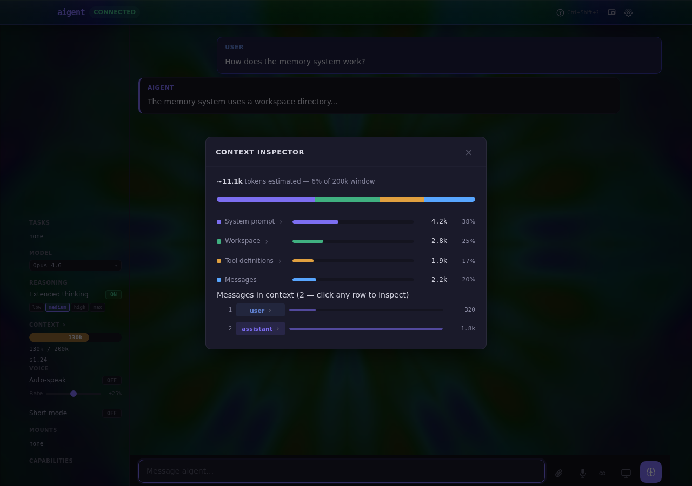

Click the context usage bar (in the header or the sidebar) to open the **Context Window** inspector overlay. Also accessible via `/context`. It shows:

- Total estimated token count and percentage of the 200k window used
- A stacked bar chart breaking usage into four components: System prompt, Workspace context, Tool definitions, and Conversation
- A per-component breakdown with individual bars, token counts, and percentages
- A per-message table listing every message in the context with its role and token cost

Each row is expandable — click to reveal the actual content sent to the model:
- **System prompt** — the base instructions text
- **Workspace** — the workspace files section (AGENTS.md, MEMORY.md, etc.)
- **Tool definitions** — name and one-line description of every active tool
- **Messages** — the raw JSON payload for each message (first ~800 characters)

### Config writes

When the agent wants to edit a workspace config file (SOUL.md, AGENTS.md, USER.md, IDENTITY.md, TOOLS.md), it uses the `request_config_write` tool. You see a modal with the proposed diff; approve to write or reject to cancel.

### Conversation persistence

Messages are saved to `localStorage` (`aigent_chat_history`) on every update and restored immediately on page load, before the WebSocket connects. This means the chat is visible even during server restarts. Messages are cleared on `/reset`.

### Settings

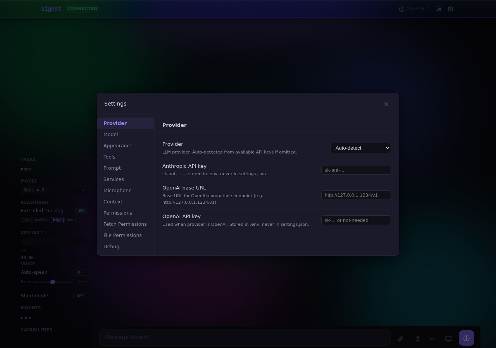

The ⚙ gear icon opens the settings panel. Settings are split into two scopes:

- **Client settings** — stored in `settings.json` on the host, applied immediately (provider, model, tools allowlist, port, STT/TTS URLs, prompt options)
- **Server settings** — stored in `.env`, require a server restart (API keys)

Key settings groups:

| Group | Settings |
|-------|----------|
| **Provider** | Provider (auto-detect / Anthropic / OpenAI), API keys (stored in `.env`), OpenAI base URL |
| **Model** | Default model, default reasoning level, speak: short |
| **Tools** | Disable all tools, tool allowlist |
| **Prompt** | Slim prompt (omit MEMORY.md), full session logs |
| **Services** | Web UI port, STT URL, TTS URL |
| **Appearance** | Background theme (aurora, spectrum, oscilloscope, circular, milkdrop, circuit, matrix, constellation, topology, ember) |
| **Microphone** | Silence threshold, speech onset frames, silence tail, auto-send on silence, auto-send duration |
| **Context** | Summarize large tool results, summarize threshold, summarize model, tool filter mode |
| **Permissions** | Exec always-allow / always-deny patterns (editable per-pattern lists) |
| **Fetch Permissions** | Fetch always-allow / always-deny patterns (hostname or URL globs) |
| **File Permissions** | File YOLO mode, read-write paths, read-only paths, deny patterns |
| **Debug** | Relay browser errors to server log |

---

## Memory system

```
/workspace/
├── config/
│   ├── AGENTS.md      — operating instructions (read-only to agent)
│   ├── SOUL.md        — personality and values
│   ├── USER.md        — info about you
│   ├── IDENTITY.md    — identity framing
│   └── TOOLS.md       — tool usage notes
├── MEMORY.md          — curated long-term knowledge (freely writable)
└── memory/
    └── YYYY-MM-DD.md  — daily session logs
```

- **Context compaction** at 70% usage — conversation is summarised in place; cost-optimised prompt
- **Cache-aware** — stable system prompt blocks are cached with Anthropic prompt caching; workspace files skip disk reads when unchanged (mtime-based)
- **Memory distillation** — on `/reset` or session end, the agent rewrites `MEMORY.md` from the day's logs
- **Daily logs** — by default only an index of log files is included in the prompt; the agent reads specific logs on demand via `read_file`. Set `AIGENT_FULL_LOGS=1` to include recent logs in full.
- **`search_memory`** — keyword search across all past daily logs at zero LLM cost
- **`search_episodes`** — semantic similarity search over episode records using local neural embeddings (all-MiniLM-L6-v2). Finds relevant past experience even when wording differs. Enable with `AIGENT_SEMANTIC_EPISODES=1`.
- **Proactive retrieval** — when semantic search is enabled, relevant past episodes are automatically surfaced before each agent turn (similarity > 0.4, max 3 results)

### Profiles and sessions

- **Profiles** — separate workspace directories, each with their own config files and memory. Use `/profiles` to list, `/profile create <name>` to create, `/profile <name>` to switch.
- **Sessions** — named save points within a profile. Use `/save`, `/sessions`, and `/load <id>` to manage them.

---

## Tools (26)

| Tool | Description |
|------|-------------|
| `exec` | Shell command with timeout and optional cwd |
| `exec_readonly` | Read-only shell commands only (git log/diff/status, ls, grep, cat, etc.) — used by background agents |
| `read_file` | File read with line-range support (offset + limit) |
| `write_file` | Write a file, creating parent directories as needed |
| `edit_file` | Surgical exact-string replacement in a file |
| `patch` | Multiple find-replace edits in one call |
| `list_files` | Directory listing |
| `grep` | Regex search with file/line results |
| `glob` | Recursive file-pattern matching (skips node_modules etc.) |
| `tree` | Directory tree, gitignore-aware |
| `fetch` | HTTP requests (all methods, optional HTML→text stripping) |
| `fetch_readonly` | GET/HEAD-only fetch — used by background agents with restricted permissions |
| `screenshot` | Capture the virtual display (Xvfb) as PNG |
| `request_screenshot` | Capture the user's live browser screen (requires screen-share active) |
| `dispatch_task` | Spawn a background agent — returns immediately, result injected later |
| `spawn_agent` | Spawn a sub-agent synchronously — blocks until done |
| `switch_model` | Change active model mid-conversation (upgrade or downgrade) |
| `host` | Call host OS capabilities: clipboard, audio, notifications, open |
| `host_edit_file` | Propose str_replace edits to a host file — user sees diff and approves |
| `request_config_write` | Propose edits to config files (SOUL.md, AGENTS.md, etc.) — user sees diff |
| `search_memory` | Keyword search across past session logs (zero LLM cost) |
| `browser_ext` | Interact with Chrome via the aigent extension (a11y tree, screenshots, tab control, script execution) |
| `ask_user` | Present a question to the user with optional multiple-choice options (free-text input always available) |
| `log_episode` | Record a structured episode — what was attempted, outcome, friction, lessons learned |
| `query_episodes` | Search and filter past episode records by domain, outcome, tags, date range |
| `search_episodes` | Semantic similarity search over episodes — finds relevant past experience even when wording differs |

---

## Configuration

### Environment variables

```bash
ANTHROPIC_API_KEY=sk-ant-...      # or use OAT token
OPENAI_API_KEY=sk-...             # for OpenAI provider
AIGENT_PROVIDER=anthropic         # anthropic | openai (auto-detected if omitted)
AIGENT_MODEL=claude-opus-4-6      # default model
AIGENT_THINKING=medium            # off | low | medium | high | max
AIGENT_SHORT=1                    # start in short/voice mode
AIGENT_WEB_PORT=3141              # web UI port
AIGENT_BASE_URL=...               # OpenAI-compatible base URL (e.g. Ollama)
AIGENT_DEBUG=1                    # verbose logging
AIGENT_SLIM_PROMPT=1              # omit MEMORY.md from system prompt
AIGENT_FULL_LOGS=1                # include recent session logs in full
AIGENT_CLASSIFIER=0               # disable Tier 3 LLM classifier (falls back to user prompts)
AIGENT_WORKSPACE=/path/to/ws      # custom workspace directory (default: workspace/ in repo root)
AIGENT_NO_TOOLS=1                 # send no tool definitions to the model
AIGENT_TOOLS_ALLOWLIST=exec,read_file  # comma-separated list of tools to enable
AIGENT_SEMANTIC_EPISODES=1               # enable semantic episode search + proactive retrieval
AIGENT_STT_URL=http://127.0.0.1:8765   # STT service endpoint
AIGENT_TTS_URL=http://127.0.0.1:8766   # TTS service endpoint
```

### TTS / STT setup

```bash
make tts-setup   # install edge-tts (Microsoft TTS, no API key needed)
make tts         # start the TTS server on port 8766

# STT uses NVIDIA Parakeet via local Python service
cd stt && pip install -r requirements.txt && python main.py
# Runs on port 8765 by default
```

TTS and STT URLs are configurable in the settings panel or via `AIGENT_TTS_URL` / `AIGENT_STT_URL`.

### MCP (Model Context Protocol)

Add external tool servers in `workspace/mcp.json`:

```json
{
  "mcpServers": {
    "github": {
      "command": "npx",
      "args": ["-y", "@modelcontextprotocol/server-github"],
      "env": { "GITHUB_PERSONAL_ACCESS_TOKEN": "ghp_..." }
    }
  }
}
```

Tools are automatically prefixed `mcp_<server>_<name>` and appear alongside built-in tools. The MCP client uses JSON-RPC 2.0 over stdio.

#### MCP permissions

By default, every MCP tool call prompts for user approval. Configure per-server and per-tool permissions in the Settings panel under **MCP Permissions**, or directly in `settings.json`:

```json
{
  "mcp_permissions": {
    "servers": {
      "github": {
        "default": "allow",
        "tools": {
          "delete_repo": "deny"
        }
      }
    }
  }
}
```

Permission levels: `"allow"` (auto-approve), `"deny"` (auto-block), `"prompt"` (ask the user, default). Per-tool overrides take precedence over the server default. Clicking **Always Allow** on an MCP approval modal adds that tool to the allow list.

---

## Chrome extension

The `aigent-extension/` directory contains a Chrome extension that enables the `browser_ext` tool. When installed, the agent can:

- Extract the accessibility tree from any tab
- Take screenshots of browser tabs (also mid-script via `{ screenshot: true }` steps)
- List, open, close, and switch tabs
- Execute JavaScript in tabs (requires user approval)
- Navigate tabs to URLs

Build with `make plugin`, or `make plugin-dev` for watch mode. The extension is also built automatically as part of `make dev` and `make dev-ts`.

**Permission model:** Read actions (a11y extraction, screenshots, listing tabs) are auto-allowed. Write actions (script execution, navigation, opening/closing tabs) show an approval prompt. Destructive actions (submit, delete, purchase, etc.) are flagged with a warning icon and cannot be bulk-approved via "Always Allow" — each destructive action requires individual confirmation.

**Security:** The extension authenticates to the gatekeeper via a per-session shared secret — fetched over HTTP on connect, validated on WebSocket upgrade — preventing other local processes from injecting browser commands. Navigate URLs are validated against the same SSRF rules as `fetch` (private IPs, metadata endpoints, etc.). All browser extension events are recorded in the audit log.

**Connection indicator:** When the extension connects, a "Browser" capability appears in the sidebar with an "on" badge. It disappears when the extension disconnects.

---

## Security model

The agent runs as an unprivileged child process. The **gatekeeper** is the sole security boundary.

### Three-tier command safety

Every `exec` call from the agent goes through three gates before it runs:

| Tier | What it does | Override? |
|------|-------------|-----------|
| **Tier 1 — Hard deny** | Blocks permanently dangerous patterns: shell injection (`$()`, backticks, `eval`, `source`, `bash -c`), credential paths (`~/.ssh`, `~/.aws`, `~/.gnupg`), destructive operations (`rm -rf /`, `mkfs`), privilege escalation (`sudo`, `su`), exfiltration (`curl \| bash`) | No — hardcoded, cannot be overridden |
| **Tier 2 — Static allow/deny** | Glob-based patterns from `settings.json`. ~40 safe defaults (git reads, ls, grep, npm test, make). You can extend with `--always` / `--always-deny` flags | Yes — user-configurable |
| **Tier 3 — Haiku classifier** | LLM-based evaluation of ambiguous commands. Returns `allow`, `block`, or `ask`. Cached (LRU 200, 30-min TTL). Fail-safe: on API error, defers to user | Fallback to user prompt |

Commands that pass Tiers 1 & 2 but aren't in the allow list go to Tier 3. If Tier 3 returns `ask`, you see a prompt: `/approve-exec <id>` or `/deny-exec <id>`. Adding `--always` promotes to the static allow list.

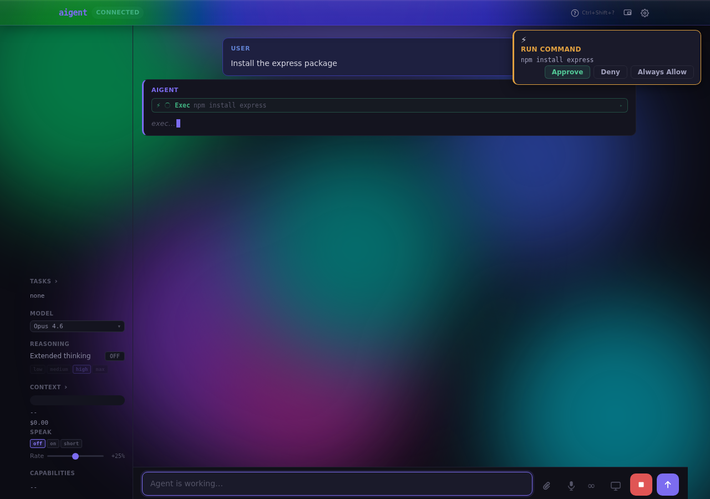

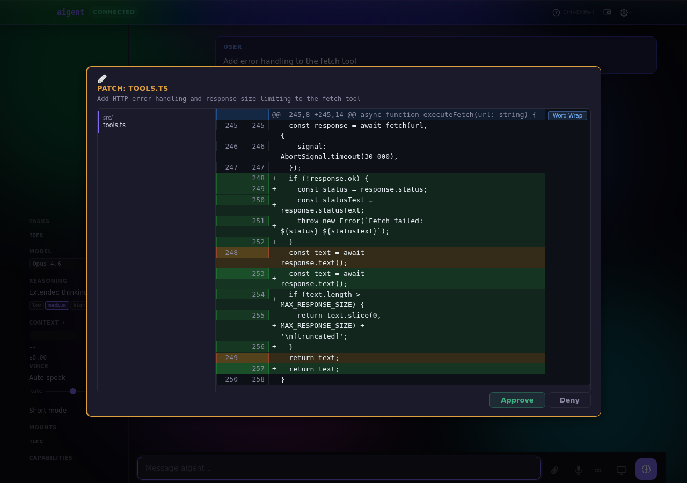

### API key isolation

`sanitizedEnv()` strips all credential variables from every spawned subprocess:
- `ANTHROPIC_API_KEY`, `OPENAI_API_KEY`, `GITHUB_TOKEN`, `AWS_SECRET_ACCESS_KEY`, and others
- Pattern-based: anything matching `/secret|token|password|credential|api[_-]?key/i`

The agent process never sees your credentials. All LLM calls are proxied through the gatekeeper.

### Fetch safety (SSRF protection)

`fetch` calls are validated against:
- Private IP ranges (10.x, 172.16-31.x, 192.168.x, 127.x, 169.254.x)
- IPv6 loopback, unique local, link-local
- Cloud metadata endpoints (169.254.169.254, metadata.google.internal)
- Non-HTTP/HTTPS protocols

A DNS lookup follows the static check to catch DNS rebinding attacks. Responses are capped at 1 MB by default; the agent must request user approval to fetch more (hard ceiling: 10 MB).

### Audit log

All security decisions are appended as JSON-lines to `/tmp/aigent-audit.log`:

```json
{"ts":1708952400123,"reqId":"f9d8e7","type":"exec_tier1_block","detail":"rm -rf /","reason":"rm on root filesystem"}
{"ts":1708952410456,"reqId":"f9d8e7","type":"exec_tier2_allow","detail":"git status"}
{"ts":1708952420789,"reqId":"f9d8e7","type":"exec_user_approve","detail":"npm install","approved":true}
```

Event types cover the full pipeline: exec (tier1/2/3/user), file (read/write/block), fetch (ssrf/dns/size/allow), and MCP tool calls. Each entry includes a `reqId` correlation ID when available, linking it to the originating user message.

**Log rotation:** Both the audit log and the gatekeeper log (`/tmp/aigent-gatekeeper.log`) are automatically rotated on startup when they exceed 5 MB. Two rotations are kept (`.1`, `.2`).

### Request tracing (`reqId`)

Every user message generates a 6-character hex correlation ID that flows through the entire stack:

```
Browser UI  →  Web bridge  →  Agent server  →  Agent  →  Tools  →  MCP servers
   f9d8e7       f9d8e7          f9d8e7        f9d8e7    f9d8e7    _meta.reqId
```

- **Structured logs** are prefixed with `[reqId]`: `2024-01-15T10:30:45.123Z [INFO] [server] [f9d8e7] Agent turn start`
- **Audit log** entries include `"reqId":"f9d8e7"` for filtering with `jq`
- **Background tasks** get a derived ID: `f9d8e7.tk01` (parent + task ID prefix)
- **MCP servers** receive the ID in the JSON-RPC `_meta` parameter

Use `grep` or `jq` to trace a single request across all logs:

```bash
grep 'f9d8e7' /tmp/aigent-gatekeeper.log
jq 'select(.reqId == "f9d8e7")' /tmp/aigent-audit.log
```

### Tool call history

Tool executions are logged to the daily session log (`workspace/memory/YYYY-MM-DD.md`) as a markdown table, surviving context compaction:

```markdown
## Tool Calls

| Time | Tool | Input | Duration | Status | Req |
|------|------|-------|----------|--------|-----|
| 14:23:05 | exec | {"command":"git status"} | 120ms | ok | f9d8e7 |
| 14:23:08 | read_file | {"path":"/src/agent.ts"} | 3ms | ok | f9d8e7 |
```

### Sensitive path protection

Sensitive paths (`~/.ssh`, `~/.gnupg`, `~/.aws`, `/proc`, `/sys`, credential files) are hard-blocked. System directories (`/etc`, `/usr`, `/var`) and broad home-directory access require user approval.

---

## Self-modification

The agent's source files live directly on your filesystem. Edits persist immediately. The file watcher ([worker.ts](src/worker.ts)) polls `src/` every second and, after a 2s debounce, runs `tsc --noEmit` before restarting the server.

```
You:   Add a tool that runs Python snippets and returns stdout
Agent: [reads tools.ts, implements PythonTool, adds to registry, runs tsc, commits]
```

### Self-mod safety

**Typecheck gate** — the server never restarts on bad code. If `tsc --noEmit` fails, the running server is left untouched and the error is logged to `/tmp/aigent-server.log`. The agent sees the failure and can fix it before the change takes effect.

**Three-tier gate** — `exec` calls the agent makes during self-modification (e.g. `git commit`, `npx tsc`) go through the same command safety pipeline as any other command.

**Rollback** — the source is a normal git repo, so you can always revert agent edits:

```bash
git diff src/               # see what the agent changed
git checkout src/<file>     # revert a specific file
git checkout src/           # revert all of src/
```

To trigger a clean restart after reverting: use the `/restart` slash command in the chat.

**Policy:** The agent may autonomously edit files in `src/` and `web/src/` as part of self-improvement. Changes to `workspace/config/` (SOUL.md, AGENTS.md, USER.md, IDENTITY.md, TOOLS.md) go through the `request_config_write` tool — you see a diff and approve or reject before anything is written.

---

## Multi-provider support

- **Anthropic** — Claude models, extended thinking, prompt caching, OAT tokens
- **OpenAI** — GPT models (streaming, tool calls, images)
- **OpenAI-compatible** — any endpoint with an OpenAI-style API (Ollama, LM Studio, etc.) via `AIGENT_BASE_URL`

Provider is auto-detected from the API key format. Override with `AIGENT_PROVIDER=openai`.

---

## Contributing

The most productive way to contribute is to run the agent and ask it to implement something. It can read the codebase, write code, run tests, and commit — treating itself as the development environment.

For security issues, open a private issue rather than a public PR.

---

## License

MIT
