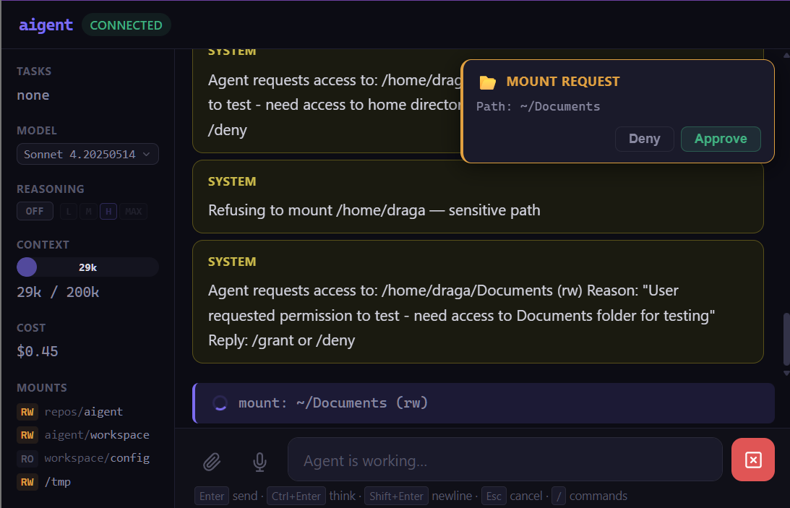

# aigent 🤖

**A self-modifying AI agent platform for AI researchers and developers.**

Built for developers working on AI agent architectures. The agent can modify its own source code, implement new capabilities, and evolve its behavior through direct code changes — making it ideal for researching self-improving AI systems.

## Core Principles

### 🔐 **Security-First Architecture**
- **Docker sandboxing** — agent isolated from host system
- **Explicit permission model** — all host access requires approval
- **Capability-based security** — granular control over clipboard, filesystem, network
- **API key isolation** — credentials never enter the sandbox
- **Mount-based filesystem access** — controlled folder sharing with ro/rw permissions

### 🧠 **Self-Authoring Agent**
- **Source code access** — agent can read and modify its own implementation
- **Hot-reload development** — changes take effect immediately
- **Persistent memory system** — maintains knowledge across sessions
- **Tool evolution** — agent can implement new capabilities
- **Architecture awareness** — understands its own design patterns

### 🌐 **Advanced Interface Layer**
- **Dual UI** — terminal and web interfaces
- **Real-time collaboration** — multiple clients, shared state
- **Background task execution** — non-blocking long-running operations
- **Host OS integration** — clipboard, screenshots, audio (permission-controlled)
- **Attachment support** — images, files, structured data
- **Voice interface** — speech-to-text input, text-to-speech output (planned)

## Architecture

```
Host Environment (Linux/WSL/macOS)
├── Gatekeeper Process
│   ├── Permission broker (mount requests, config changes)
│   ├── Container lifecycle management
│   └── TUI/Web UI coordination
├── Host Daemon
│   ├── OS capability providers (clipboard, screen, audio)
│   ├── Permission store with user prompts
│   └── Secure capability execution
├── LLM Proxy
│   ├── API key/token management
│   ├── Provider abstraction (Anthropic, OpenAI)
│   └── Request caching and optimization
└── Docker Sandbox
    ├── Agent Server (conversation engine)
    ├── File watcher (auto-restart on source changes)
    ├── Tool execution layer (12+ capabilities)
    └── Memory management (workspace persistence)
```

## For AI Researchers

This platform enables research into:

- **Self-modifying code architectures** — watch agents improve their own implementations
- **Tool evolution** — study how agents develop new capabilities
- **Memory and continuity** — persistent agent personalities and knowledge
- **Security boundaries** — controlled environment for capability research
- **Human-AI collaboration** — permission models and trust mechanisms

### Research Features
- **Conversation logging** — all interactions automatically archived
- **Code diff tracking** — agent changes are version-controlled
- **Performance metrics** — token usage, cache hits, execution timing
- **Multi-model support** — test different reasoning approaches
- **Background processing** — parallel task execution and coordination

## Quick Start

**Prerequisites:** Docker, Node.js 22+, Anthropic API access

```bash
# Clone and configure
git clone <repo> && cd aigent
echo 'ANTHROPIC_API_KEY=sk-ant-...' > .env

# Launch with development mount
npm run start ~/my-research-project --rw

# Or headless mode for web-only interface
npm run headless
```

The agent immediately has access to:
- Its own source code (`/app/src/`)
- Your project files (`/project/my-research-project/`)
- Persistent workspace (`/workspace/`)

## Development Workflow

### Agent Self-Modification
```
You: Add support for executing Rust code
Agent: [reads tool definitions, implements RustTool class, updates tool registry, tests with hello world, commits changes]
```

### Research Iteration
```
You: Implement a new memory compression algorithm
Agent: [analyzes current memory system, designs new approach, implements in compact.ts, benchmarks performance, documents findings]
```

### Capability Evolution  
```
You: Add screenshot analysis capabilities
Agent: [integrates with host daemon, implements image processing, adds UI controls, tests with examples]
```

## Advanced Features

### Permission System
- **Mount requests** — agent can request access to new folders
- **Capability grants** — clipboard, screen, network access with user approval
- **Time-limited permissions** — temporary access that expires
- **Audit logging** — all permission decisions recorded



*Example: Agent requesting permission to mount a new folder - user sees clear approval dialog*

### Memory Architecture
- **Short-term** — conversation context with intelligent compaction
- **Long-term** — curated knowledge in `/workspace/MEMORY.md`
- **Session logs** — daily archives for pattern analysis
- **Personality persistence** — agent traits survive restarts

### Tool System
Extensible capability framework:
- **File operations** — read, write, edit, search, diff
- **Shell execution** — full bash access with timeout control
- **Network access** — HTTP requests with response processing
- **Host integration** — clipboard, screenshots, notifications
- **Agent spawning** — background task delegation
- **Self-modification** — source code editing with hot-reload

## Configuration

### Environment Variables
```bash
ANTHROPIC_API_KEY=sk-ant-...           # API access
AIGENT_MODEL=claude-opus-4-6          # Default model
AIGENT_THINKING=medium                 # Reasoning depth
AIGENT_DEBUG=1                         # Verbose logging
```

### Workspace Structure
```
workspace/
├── config/           # Read-only agent configuration
│   ├── SOUL.md      # Personality and values  
│   ├── USER.md      # Information about you
│   └── AGENTS.md    # Operating instructions
├── MEMORY.md        # Curated long-term knowledge
├── TOOLS.md         # Tool usage notes
└── memory/          # Session archives
    └── YYYY-MM-DD.md
```

### Security Configuration
```
~/.config/aigent/permissions.json    # Host capability permissions
```

## API Integration

Supports multiple providers:
- **Anthropic** — Claude models with system prompt caching
- **OpenAI** — GPT models (experimental)
- **Claude Code tokens** — subscription-based access

Authentication auto-detected from API key format.

## Contributing

The agent is designed to evolve itself. Major contributions typically happen through:

1. **Agent-driven development** — ask the agent to implement features
2. **Architecture discussions** — explore new capability designs  
3. **Security research** — test sandbox boundaries and permission models
4. **Performance optimization** — improve reasoning efficiency

## License

MIT License — designed for research and development use.

---

**Note:** This is research software. The agent can modify its own code and request system access. Run only in controlled environments with appropriate security precautions.
